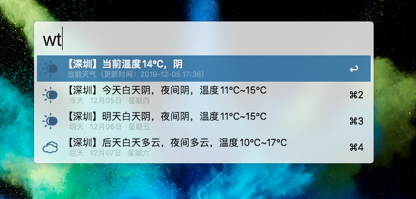
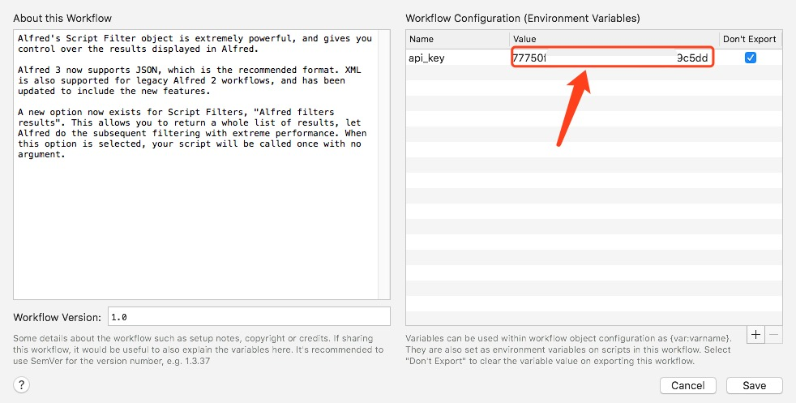

## 功能说明

查询天气，可以显示近三天的天气情况。

天气API使用 [和风天气](https://dev.heweather.com/docs/getting-started/) 。

**keyword**： wt

**查询城市**：
- 自动定位。
- 中文城市。例：深圳，南山区
- 拼音。 例：shenzhen

## 使用说明

1. 安装 workflow
2. [和风天气](https://dev.heweather.com/docs/getting-started/) 注册，申请api_key
3. 设置 api_key

